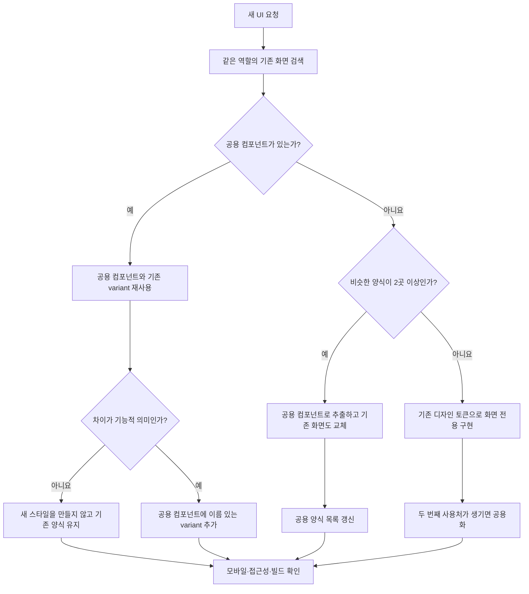

# UI 일관성 규칙

새 화면은 새 스타일을 먼저 만들지 않고, 같은 역할을 하는 기존 화면과 공용 컴포넌트를 먼저 찾는다.

## 공용 양식 목록

| 역할 | 공용 구현 | 사용 원칙 |
| --- | --- | --- |
| 폴더·목록 상세 상단 행 | `FolderDetailHeader` | 뒤로가기, 제목, 편집·동기화 액션은 이 컴포넌트로 통일 |
| 화면/목록 전환, 단일 선택 | `Segmented` | 화면 전환은 `tabs`, 폼 선택은 `single-select` 의미 사용 |
| 색상 선택 | `ColorPicker` | 색상 원형, 선택 테두리, 접근성 역할을 공용 처리 |
| 바텀시트 | `Sheet` | 닫기·스와이프·배경 처리를 개별 구현하지 않음 |
| 드롭다운 | `ThemeSelect` | 브라우저 기본 select 대신 앱 테마 사용 |
| 확인·삭제 확인 | `ConfirmDialog` | `confirm()`을 새로 추가하지 않고 공용 대화상자 사용 |
| 아이콘 | `Icon`, `TypeGlyph` | 같은 의미에는 같은 이름과 선 굵기 사용 |
| 기본 버튼 | `.btn` 변형 | `primary`, `subtle`, `danger` 중 의미에 맞게 선택 |

## 개발 요청 판단 흐름

## 완료 기준

- 390px 안팎 모바일 폭에서 제목과 액션이 겹치지 않는다.
- 클릭 가능한 아이콘은 `aria-label`이 있고 선택형 컨트롤은 상태를 전달한다.
- 색상, 테두리, 간격은 `styles.css`의 기존 변수와 공용 클래스를 쓴다.
- 짧은 액션 버튼 문구는 모바일에서도 줄바꿈하지 않는다. 같은 행의 버튼은 `white-space: nowrap`과 유연한 폭·간격으로 한 줄을 유지한다.
- 기능 확인만으로 끝내지 않고 실제 화면에서 헤더·탭·본문의 좌우 정렬선, 요소 간격, 빈 상태의 중심, 의도하지 않은 줄바꿈을 함께 검토한다.
- 유사한 JSX/CSS가 두 화면 이상이면 복사 전에 공용화 여부를 판단한다.
- `npm run build`가 통과해야 한다.
